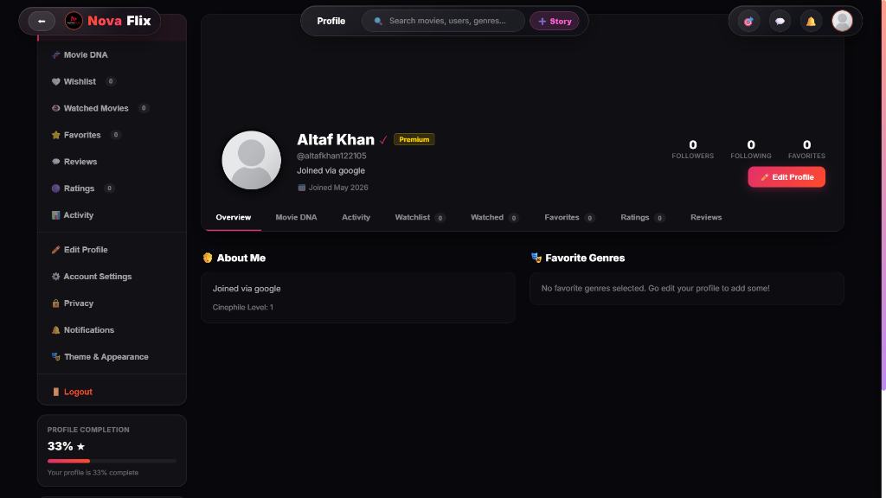

# 🎬 Novaflix 2.0 Frontend

The frontend interface for **Novaflix 2.0**, built with **React**, **Vite**, and custom **Glassmorphism CSS**.

---

## 📸 Screenshots

| Discover Page | Movie Details Page |
| :---: | :---: |
|  |  |

| Smart Recommendations | Direct Messaging |
| :---: | :---: |
|  |  |

| User Profile | Anime Collection |
| :---: | :---: |
|  |  |


---

## 🚀 Getting Started

```bash
npm install
npm run dev
```
