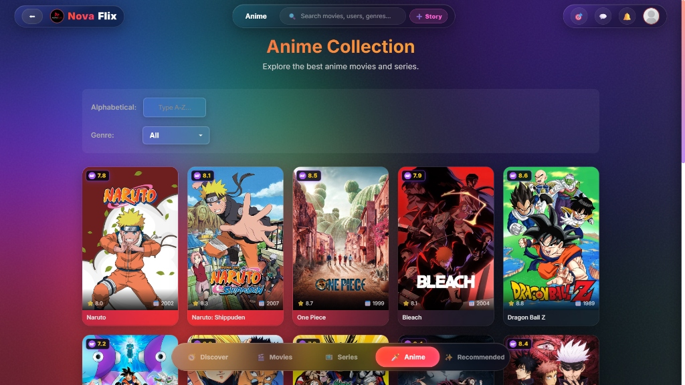
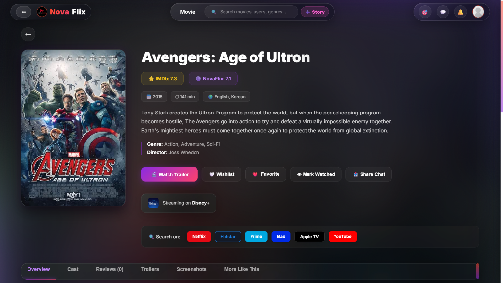
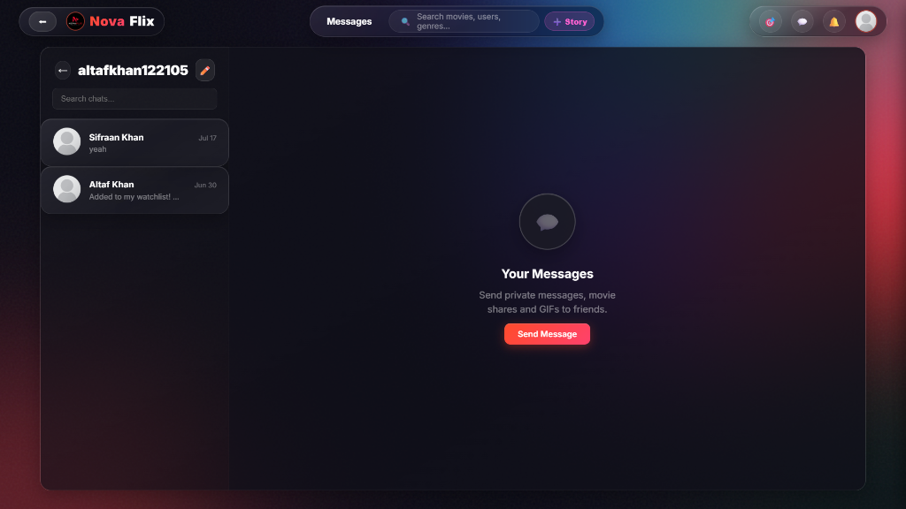
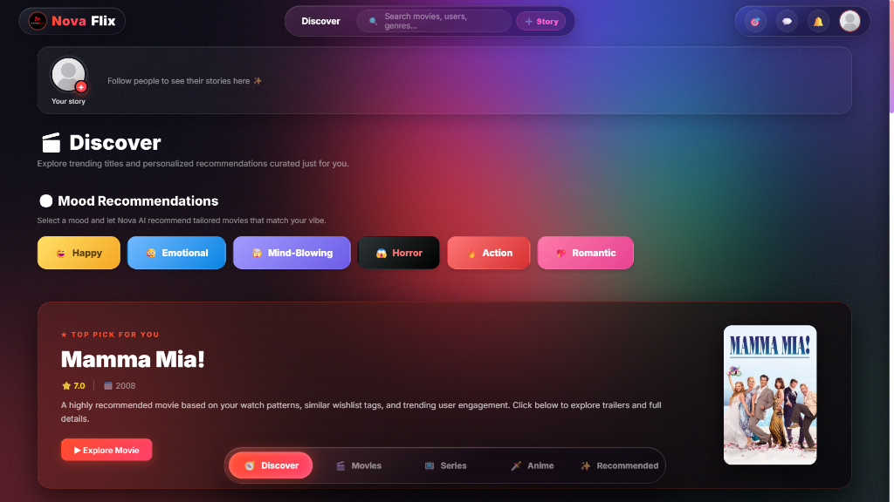

## 📸 Project Preview

Below is a preview of the Novaflix 2.0 interface.







# 🎬 Movie Recommendation System by Altaf Khan

A content-based movie recommendation web application built using Python, Machine Learning, and Streamlit.
The system suggests movies based on similarity and provides detailed information including posters, ratings, cast, and trailers.

---

## 🚀 Features

* 🔍 Recommend movies based on similarity
* 🎯 Three types of recommendations:

  * Recommended Movies (most accurate)
  * Based on Genre
  * Based on Cast / Director
* ⭐ IMDb rating and release year
* 🖼️ Movie posters using OMDb API
* 📖 Full movie description (detailed plot)
* 👨‍🎬 Cast information
* ▶ Watch trailer option (YouTube integration)
* 📊 Browse all movies with pagination

---

## 🧠 How It Works

* Uses **content-based filtering**
* Combines features like:

  * Genres
  * Keywords
  * Cast
  * Director
* Converts text data into vectors using **CountVectorizer**
* Computes similarity using **cosine similarity**
* Recommends top similar movies based on selected input

---

## 🛠️ Tech Stack

* Python
* Pandas
* Scikit-learn
* Streamlit
* OMDb API

---

## 📂 Project Structure

```bash
Movie-Recommender-System/
│
├── Files/                  # Dataset and required .pkl files
├── processing/             # Core logic (preprocessing & recommendation)
├── main.py                 # Streamlit app
├── requirements.txt
└── README.md
```

---

## ⚙️ Installation Guide

1. Clone the repository:

```bash
git clone https://github.com/ialtaf14/Novaflix.git
```

1. Navigate to the project:

```bash
cd Movie-Recommender-System
```

1. Install dependencies:

```bash
pip install -r requirements.txt
```

1. generate your omdb api key and paste in preprocess.py in line 204:
 url = f"<http://www.omdbapi.com/?t={selected_movie_name}&plot=full&apikey=OMDBAPIKEY>"

2. Run the application:

```bash
streamlit run main.py 

# or 
python -m streamlit run main.py
```

---

## ⚠️ Important Note

Large similarity `.pkl` files are not included due to GitHub size limits.

They will be automatically generated when you run the project for the first time.
👉 The first run may take a few seconds.

## 📜 License

This project is for educational purposes.
